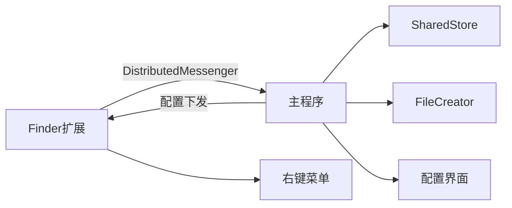

# MacRightClick 项目架构总览

## 1. 项目定位
`MacRightClick` 是一个 macOS 主程序 + Finder 扩展的双进程项目。
主程序负责配置、授权、模板管理与实际文件操作；Finder 扩展只负责在 Finder 右键菜单里展示入口并把动作转发给主程序执行。

## 2. 目录一览（只看核心）

```text
MacRightClick/
├─ MacRightClick/                    # 主程序（SwiftUI）
│  ├─ MacRightClickApp.swift         # App 入口，场景、消息总线、业务动作分发
│  ├─ ContentView.swift              # 主界面（NavigationSplitView）
│  ├─ SettingsView.swift             # 设置页（扩展开关、Dock/菜单栏显示）
│  ├─ IconCustomization/             # 图标自定义（Dock + 菜单栏）
│  ├─ *View.swift                    # 功能页面（模板/菜单配置/授权目录/常用目录/常用App/日志）
│  └─ DockVisibility.swift           # Dock 显隐控制
├─ MacRightClickFinderExtension/     # Finder 扩展进程
│  └─ FinderSync.swift               # 右键菜单构建、点击事件上报
├─ Shared/                           # 主程序与扩展共享模型/存储/通信
│  ├─ Messenger.swift                # DistributedNotification 消息协议
│  ├─ FileTemplate.swift             # 模板模型
│  ├─ TemplateStore.swift            # 模板存储与同步
│  ├─ MenuConfig.swift               # 菜单配置模型与存储
│  ├─ AuthorizedFolderStore.swift    # 授权目录书签（security scoped）
│  ├─ FavoriteFolderStore.swift      # 常用目录存储
│  ├─ FavoriteAppStore.swift         # 常用 App 存储
│  ├─ FileCreator.swift              # 实际文件创建逻辑
│  ├─ LogStore.swift                 # 日志存储与主/扩展日志汇总
│  └─ AppGroup.swift                 # App Group 常量与 UserDefaults 入口
└─ docs/                             # 项目文档
```

## 3. 运行时架构（高层）



## 4. 主程序关键职责

文件：[MacRightClickApp.swift](/Users/wangpenglong/projects/swift/MacRightClick/MacRightClick/MacRightClickApp.swift)

1. 启动时初始化与状态下发
- 发送 `update-scope`（授权目录）
- 发送 `update-templates`（已启用模板）
- 发送 `update-menu-config`
- 发送 `update-favorites`（常用目录/常用 App）
- 发送 `app-running`

2. 监听扩展动作并执行真实业务
- `create-file`：调用 `FileCreator` 在目标目录创建文件
- `open-terminal`：打开终端到指定目录
- `open-favorite-folder`：打开目录
- `open-favorite-app`：打开应用
- `move-items`：移动文件到常用目录

3. 安全边界
- 任何涉及文件系统操作都通过 `AuthorizedFolderStore` 的 security-scoped access 进行访问
- 未授权目录会被拦截并记录日志

## 5. Finder 扩展关键职责

文件：[FinderSync.swift](/Users/wangpenglong/projects/swift/MacRightClick/MacRightClickFinderExtension/FinderSync.swift)

1. 只做菜单层，不做重业务执行
- 根据主程序下发的配置，动态构建右键菜单
- 区分空白区域菜单（container）与选中文件菜单（items）

2. 动作转发
- 点击菜单后通过 `DistributedMessenger.sendToApp(...)` 上报动作
- 扩展进程不直接创建文件，不直接维护完整业务状态

3. 主程序存活保护
- `isHostAppOpen == false` 时不返回任何菜单，避免“扩展先起、主程序未起”的异常状态

## 6. 进程间通信协议

文件：[Messenger.swift](/Users/wangpenglong/projects/swift/MacRightClick/Shared/Messenger.swift)

通信方式：`DistributedNotificationCenter` + `MessagePayload(JSON)`

常见 `action`：
- 主程序 -> 扩展：`update-scope` / `update-templates` / `update-menu-config` / `update-favorites` / `app-running` / `app-quit`
- 扩展 -> 主程序：`create-file` / `open-terminal` / `open-favorite-folder` / `open-favorite-app` / `move-items` / `log`

设计原则：
- 共享“数据结构”，不共享“执行权限”
- 扩展是入口层，主程序是执行层

## 7. 数据与存储分层

### 7.1 模型层
- 文件模板：`FileTemplate`, `TemplateKind`（[FileTemplate.swift](/Users/wangpenglong/projects/swift/MacRightClick/Shared/FileTemplate.swift)）
- 菜单配置：`MenuConfig`（[MenuConfig.swift](/Users/wangpenglong/projects/swift/MacRightClick/Shared/MenuConfig.swift)）
- 常用目录/App：`FavoriteFolder`, `FavoriteApp`

### 7.2 持久化层（App Group UserDefaults）
- `TemplateStore`：模板读写与默认模板合并
- `MenuConfigStore`：右键菜单开关
- `AuthorizedFolderStore`：保存授权目录书签（bookmark）
- `FavoriteFolderStore` / `FavoriteAppStore`：收藏项
- `IconCustomizationStore`：Dock/菜单栏图标来源及书签

### 7.3 执行层
- `FileCreator`：创建 txt/md/json/pdf/office 占位文件（[FileCreator.swift](/Users/wangpenglong/projects/swift/MacRightClick/Shared/FileCreator.swift)）

## 8. UI 架构（主程序）

文件：[ContentView.swift](/Users/wangpenglong/projects/swift/MacRightClick/MacRightClick/ContentView.swift)

- 顶层使用 `NavigationSplitView`
- 左侧 Sidebar：授权目录 / 文件模板 / 菜单配置 / 常用目录 / 常用 App / 日志 / 设置
- 右侧 Detail：按 sidebar 选中项加载对应功能页
- `SettingsView` 同时也作为独立 Settings Scene 展示

## 9. 日志体系

文件：[LogStore.swift](/Users/wangpenglong/projects/swift/MacRightClick/Shared/LogStore.swift)

- 统一入口：`AppLogger.log(level, message, category)`
- 主程序：写入 App Group 容器下 `Logs/macrightclick.log.jsonl`
- 扩展：通过 `action=log` 把日志回传主程序，由主程序持久化

## 10. 权限与沙盒

- App 与扩展均启用了 `app-sandbox`
- 两者共享 `application-groups = group.com.biliww.MacRightClick`
- 主程序额外开启 `com.apple.security.files.bookmarks.app-scope`（用于长期书签访问）

参考：
- [MacRightClick.entitlements](/Users/wangpenglong/projects/swift/MacRightClick/MacRightClick/MacRightClick.entitlements)
- [MacRightClickFinderExtension.entitlements](/Users/wangpenglong/projects/swift/MacRightClick/MacRightClickFinderExtension/MacRightClickFinderExtension.entitlements)

## 11. 典型业务时序（新建文件）

1. 用户在 Finder 空白处右键，扩展展示“新建文件”
2. 扩展发送 `create-file(target, templateID)` 给主程序
3. 主程序校验目录授权（security scoped bookmark）
4. 主程序调用 `FileCreator.createFile(...)`
5. 主程序写日志并返回（扩展无需等待复杂结果）

## 12. 后续改动入口（维护速查）

- 想改右键菜单结构：`MacRightClickFinderExtension/FinderSync.swift`
- 想改模板模型/默认模板：`Shared/FileTemplate.swift`
- 想改模板持久化与同步：`Shared/TemplateStore.swift`
- 想改授权策略：`Shared/AuthorizedFolderStore.swift` + `MacRightClickApp.swift`
- 想改消息协议：`Shared/Messenger.swift`（需主程序与扩展同时改）
- 想改设置页展示：`MacRightClick/SettingsView.swift`
- 想改图标自定义：`MacRightClick/IconCustomization/*`
- 想改日志结构：`Shared/LogStore.swift`

## 13. 一句话总结

这个项目是“主程序负责执行 + Finder 扩展负责入口 + Shared 层负责协议与持久化”的清晰三层结构；只要沿着这条分层线改动，功能扩展会稳定、可维护。
